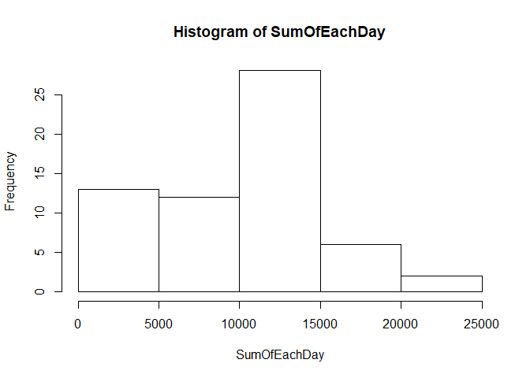
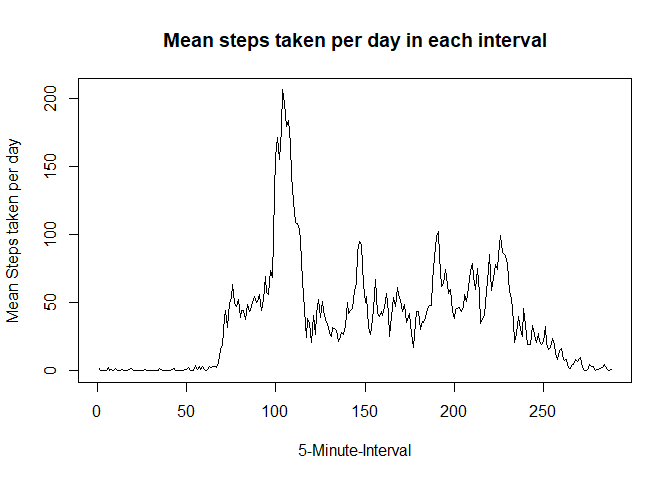
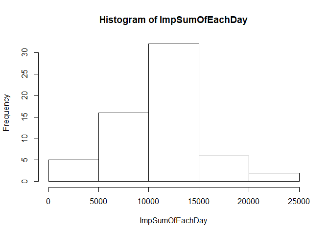
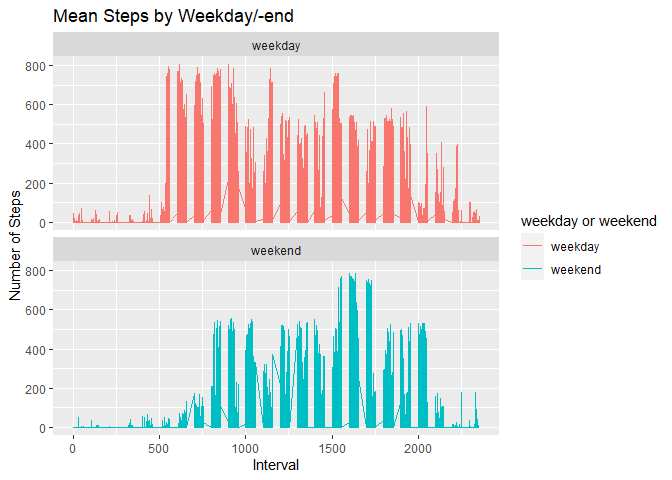

## Loading and preprocessing the data

```r
library(ggplot2)
library(data.table)
library(DMwR)
```

```
## Loading required package: lattice
```

```
## Loading required package: grid
```

```
## Registered S3 method overwritten by 'quantmod':
##   method            from
##   as.zoo.data.frame zoo
```

```r
dat <- data.table(read.csv("activity.csv"))
```

## What is mean total number of steps taken per day?

```r
NumOfDays <- length(unique(dat$date))
SumOfEachDay <- tapply(dat$steps, dat$date, sum, na.rm = TRUE)
MeanTotalSteps <- mean(SumOfEachDay)
MedianTotalSteps <- median(SumOfEachDay)
hist(x = SumOfEachDay)
```

<!-- -->

```r
MeanTotalSteps
```

```
## [1] 9354.23
```

```r
MedianTotalSteps
```

```
## [1] 10395
```

## What is the average daily activity pattern?

```r
IntMean <- tapply(dat$steps, dat$interval, mean, na.rm = TRUE)
plot(IntMean, type = "l", xlab = "5-Minute-Interval", ylab = "Mean Steps taken per day", main = "Mean steps taken per day in each interval")
```

<!-- -->

```r
MaxStepsInt <- which.max(IntMean)
MaxStepsInt
```

```
## 835 
## 104
```

## Imputing missing values
In this section we use the K-Neares-Neighbour approach to impute the missing values. For this we make use of the DMwR package, which is available on CRAN.

```r
LogicalNA <- is.na(dat)
NumOfNA <- sum(LogicalNA)
datImp <- knnImputation(dat, k = 10)

ImpSumOfEachDay <- tapply(datImp$steps, datImp$date, sum)
ImpMeanTotalSteps <- mean(ImpSumOfEachDay)
ImpMedianTotalSteps <- median(ImpSumOfEachDay)
hist(x = ImpSumOfEachDay)
```

<!-- -->

```r
ImpMeanTotalSteps
```

```
## [1] 10637.85
```

```r
ImpMedianTotalSteps
```

```
## [1] 10600
```


## Are there differences in activity patterns between weekdays and weekends?

```r
datImp2 <- cbind(datImp, weekdays(as.Date(datImp$date)))
names(datImp2) <- c("steps", "date", "interval", "weekday")
datImp2 <- data.table(datImp2)
datImp2[grepl(pattern = "Montag|Dienstag|Mittwoch|Donnerstag|Freitag", x = `weekday`), "weekday or weekend"] <- "weekday"
datImp2[grepl(pattern = "Samstag|Sonntag", x = `weekday`), "weekday or weekend"] <- "weekend"
datImp2[, `weekday or weekend` := as.factor(`weekday or weekend`)]

ggplot(datImp2 , aes(x = interval , y = steps, color=`weekday or weekend`)) + geom_line() + labs(title = "Mean Steps by Weekday/-end", x = "Interval", y = "Number of Steps") + facet_wrap(~`weekday or weekend` , ncol = 1, nrow=2)
```

<!-- -->
